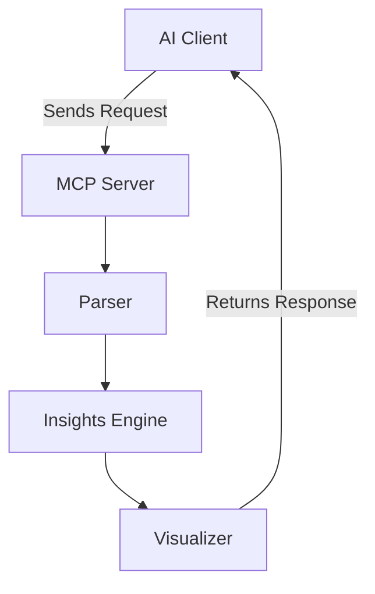

# MCP-InsightEngine

## Project Overview

**MCP-InsightEngine** is a **large language model (LLM)-based file analysis and insight generation tool** built using **Model Context Protocol (MCP)**. It intelligently analyzes structured and unstructured files (CSV, JSON, PDF, and text) to extract **actionable insights**, detect anomalies, and generate summaries. This project demonstrates expertise in **AI/ML pipeline development, LLM integration, and scalable data intelligence**.

## Architecture diagram


## 🧩 High-Level Architecture

- At its core, the MCP-InsightEngine comprises several key components:

- **MCP Server (mcp_server.py)**: Acts as the central server that listens for incoming requests from AI clients.

- **Parser (parser.py)**: Handles the interpretation of incoming data, ensuring it's in a format that the server can process.

- **Insights Engine (insights.py)**: Processes the parsed data to extract meaningful insights or perform specific actions.

- **Visualizer (visualizer.py)**: Generates visual representations of the insights for easier understanding and analysis.

## 🔄 Data Flow

- **Client Request**: An AI client sends a request to the MCP server, typically in the form of an HTTP request.

- **Parsing**: The parser.py module processes the incoming request, extracting relevant data and converting it into a structured format.

- **Insight Generation**: The structured data is passed to the insights.py module, which analyzes it to generate insights or perform actions.

- **Visualization**: The visualizer.py module takes the generated insights and creates visual representations, such as graphs or charts.

- **Response**: The visualizations and insights are sent back to the AI client as a response.

## Key Features

- **LLM-Powered File Analysis:** Understands context and content beyond keyword matching.  

- **Multi-Format File Support:** CSV, JSON, PDF, and plain text. 

- **Actionable Insights:** Generates summaries, trend highlights, and anomaly detection.  

- **Modular & Scalable Architecture:** Built on MCP for extensible AI pipelines.  

- **Interactive Frontend:** Streamlit interface for real-time file upload and analysis.

## Technologies and Skills

- **Programming Languages:** Python  

- **AI/ML:** OpenAI GPT-4, custom LLMs, natural language processing (NLP)  

- **Backend & APIs:** FastAPI  

- **Data Processing:** Pandas, PyMuPDF  

- **Frontend:** Streamlit  

- **Dependency Management:** `uv` package manager  

- **Software Development Skills:** Scalable AI pipelines, modular architecture, LLM integration, data intelligence  

## Installation

Clone the repository and install dependencies using `uv`:

```bash
git clone https://github.com/anulsasidharan/MCP-InsightEngine.git
cd MCP-InsightEngine
uv add -r requirements.txt
```
