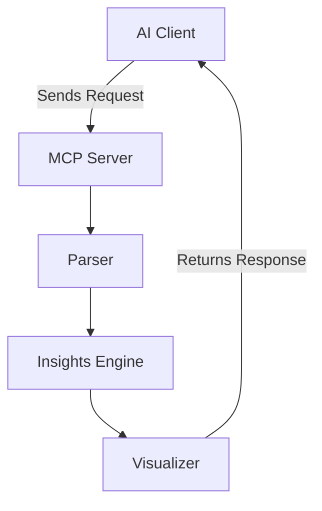

# MCP-InsightEngine

## Project Overview

**MCP-InsightEngine** is a **large language model (LLM)-based file analysis and insight generation tool** built using **Model Context Protocol (MCP)**. It intelligently analyzes structured and unstructured files (CSV, JSON, PDF, and text) to extract **actionable insights**, detect anomalies, and generate summaries. This project demonstrates expertise in **AI/ML pipeline development, LLM integration, and scalable data intelligence**.

## Architecture diagram



## Key Features

- **LLM-Powered File Analysis:** Understands context and content beyond keyword matching.  
- **Multi-Format File Support:** CSV, JSON, PDF, and plain text.  
- **Actionable Insights:** Generates summaries, trend highlights, and anomaly detection.  
- **Modular & Scalable Architecture:** Built on MCP for extensible AI pipelines.  
- **Interactive Frontend:** Streamlit interface for real-time file upload and analysis.

## Technologies and Skills

- **Programming Languages:** Python  
- **AI/ML:** OpenAI GPT-4, custom LLMs, natural language processing (NLP)  
- **Backend & APIs:** FastAPI  
- **Data Processing:** Pandas, PyMuPDF  
- **Frontend:** Streamlit  
- **Dependency Management:** `uv` package manager  
- **Software Development Skills:** Scalable AI pipelines, modular architecture, LLM integration, data intelligence  

## Installation

Clone the repository and install dependencies using `uv`:

```bash
git clone https://github.com/anulsasidharan/MCP-InsightEngine.git
cd MCP-InsightEngine
uv add -r requirements.txt
```
